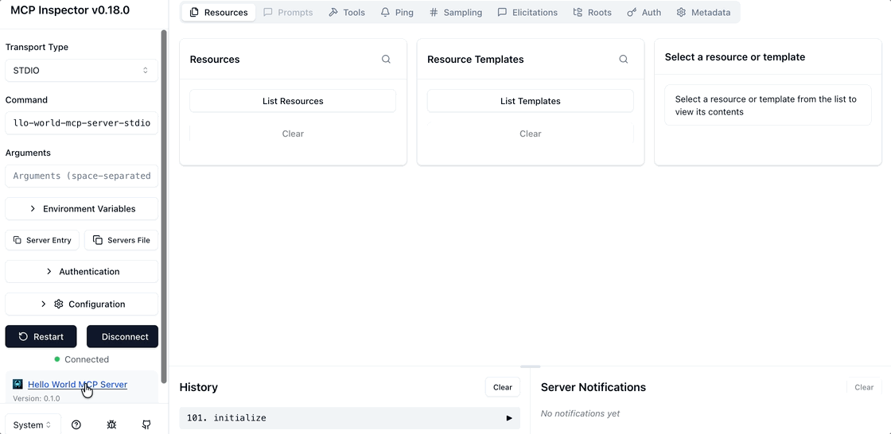

<p align="center">
  
</p>

# Rust MCP SDK

[](https://crates.io/crates/rust-mcp-sdk)
[](https://docs.rs/rust-mcp-sdk)
[
](https://github.com/rust-mcp-stack/rust-mcp-sdk/actions/workflows/ci.yml)
[
](examples/hello-world-mcp-server)

A high-performance, asynchronous toolkit for building MCP servers and clients.
Focus on your app's logic while **rust-mcp-sdk** takes care of the rest!

**rust-mcp-sdk** provides the necessary components for developing both servers and clients in the MCP ecosystem.
Leveraging the [rust-mcp-schema](https://github.com/rust-mcp-stack/rust-mcp-schema) crate simplifies the process of building robust and reliable MCP servers and clients, ensuring consistency and minimizing errors in data handling and message processing.

This project currently supports following transports:
- **stdio** (Standard Input/Output)
- **sse** (Server-Sent Events).


🚀 The **rust-mcp-sdk** includes a lightweight [Axum](https://github.com/tokio-rs/axum) based server that handles all core functionality seamlessly. Switching between `stdio` and `sse` is straightforward, requiring minimal code changes. The server is designed to efficiently handle multiple concurrent client connections and offers built-in support for SSL.

**⚠️** **Streamable HTTP** transport and authentication still in progress and not yet available. Project is currently under development and should be used at your own risk.

## Table of Contents
- [Usage Examples](#usage-examples)
  - [MCP Server (stdio)](#mcp-server-stdio)
  - [MCP Server (sse)](#mcp-server-sse)
  - [MCP Client (stdio)](#mcp-client-stdio)
  - [MCP Client (sse)](#mcp-client-sse)
- [Cargo features](#cargo-features)
  -  [Available Features](#available-features)
  -  [Default Features](#default-features)
  -  [Using Only the server Features](#using-only-the-server-features)
  -  [Using Only the client Features](#using-only-the-client-features)
- [Choosing Between Standard and Core Handlers traits](#choosing-between-standard-and-core-handlers-traits)
  - [Choosing Between **ServerHandler** and **ServerHandlerCore**](#choosing-between-serverhandler-and-serverhandlercore)
  - [Choosing Between **ClientHandler** and **ClientHandlerCore**](#choosing-between-clienthandler-and-clienthandlercore)
- [Projects using Rust MCP SDK](#projects-using-rust-mcp-sdk)
- [Contributing](#contributing)
- [Development](#development)
- [License](#license)

## Usage Examples

### MCP Server (stdio)

Create a MCP server with a `tool` that will print a `Hello World!` message:

```rust
#[tokio::main]
async fn main() -> SdkResult<()> {

    // STEP 1: Define server details and capabilities
    let server_details = InitializeResult {
        // server name and version
        server_info: Implementation {
            name: "Hello World MCP Server".to_string(),
            version: "0.1.0".to_string(),
        },
        capabilities: ServerCapabilities {
            // indicates that server support mcp tools
            tools: Some(ServerCapabilitiesTools { list_changed: None }),
            ..Default::default() // Using default values for other fields
        },
        meta: None,
        instructions: Some("server instructions...".to_string()),
        protocol_version: LATEST_PROTOCOL_VERSION.to_string(),
    };

    // STEP 2: create a std transport with default options
    let transport = StdioTransport::new(TransportOptions::default())?;

    // STEP 3: instantiate our custom handler for handling MCP messages
    let handler = MyServerHandler {};

    // STEP 4: create a MCP server
    let server: ServerRuntime = server_runtime::create_server(server_details, transport, handler);

    // STEP 5: Start the server
    server.start().await

}
```

See hello-world-mcp-server example running in [MCP Inspector](https://modelcontextprotocol.io/docs/tools/inspector) :



### MCP Server (sse)

Creating an MCP server in `rust-mcp-sdk` with the `sse` transport allows multiple clients to connect simultaneously with no additional setup.
Simply create a Hyper Server using `hyper_server::create_server()` and pass in the same handler and transform options.

```rust

// STEP 1: Define server details and capabilities
let server_details = InitializeResult {
    // server name and version
    server_info: Implementation {
        name: "Hello World MCP Server".to_string(),
        version: "0.1.0".to_string(),
    },
    capabilities: ServerCapabilities {
        // indicates that server support mcp tools
        tools: Some(ServerCapabilitiesTools { list_changed: None }),
        ..Default::default() // Using default values for other fields
    },
    meta: None,
    instructions: Some("server instructions...".to_string()),
    protocol_version: LATEST_PROTOCOL_VERSION.to_string(),
};

// STEP 2: instantiate our custom handler for handling MCP messages
let handler = MyServerHandler {};

// STEP 3: instantiate HyperServer, providing `server_details` , `handler` and HyperServerOptions
let server = hyper_server::create_server(
    server_details,
    handler,
    HyperServerOptions {
        host: "127.0.0.1".to_string(),
        ..Default::default()
    },
);

// STEP 4: Start the server
server.start().await?;

Ok(())
```


The implementation of `MyServerHandler` is the same regardless of the transport used and could be as simple as the following:

```rust

// STEP 1: Define a rust_mcp_schema::Tool ( we need one with no parameters for this example)
#[mcp_tool(name = "say_hello_world", description = "Prints \"Hello World!\" message")]
#[derive(Debug, Deserialize, Serialize, JsonSchema)]
pub struct SayHelloTool {}

// STEP 2: Implement ServerHandler trait for a custom handler
// For this example , we only need handle_list_tools_request() and handle_call_tool_request() methods.
pub struct MyServerHandler;

#[async_trait]
impl ServerHandler for MyServerHandler {
    // Handle ListToolsRequest, return list of available tools as ListToolsResult
    async fn handle_list_tools_request(&self, request: ListToolsRequest, runtime: &dyn McpServer) -> Result<ListToolsResult, RpcError> {

        Ok(ListToolsResult {
            tools: vec![SayHelloTool::tool()],
            meta: None,
            next_cursor: None,
        })

    }

    /// Handles requests to call a specific tool.
    async fn handle_call_tool_request( &self, request: CallToolRequest, runtime: &dyn McpServer, ) -> Result<CallToolResult, CallToolError> {

        if request.tool_name() == SayHelloTool::tool_name() {
            Ok(CallToolResult::text_content(
                "Hello World!".to_string(),
                None,
            ))
        } else {
            Err(CallToolError::unknown_tool(request.tool_name().to_string()))
        }

    }
}
```

---

👉 For a more detailed example of a [Hello World MCP](https://github.com/rust-mcp-stack/rust-mcp-sdk/tree/main/examples/hello-world-mcp-server) Server that supports multiple tools and provides more type-safe handling of `CallToolRequest`, check out: **[examples/hello-world-mcp-server](https://github.com/rust-mcp-stack/rust-mcp-sdk/tree/main/examples/hello-world-mcp-server)**

See hello-world-server-sse example running in [MCP Inspector](https://modelcontextprotocol.io/docs/tools/inspector) :


---

### MCP Client (stdio)

Create an MCP client that starts the [@modelcontextprotocol/server-everything](https://www.npmjs.com/package/@modelcontextprotocol/server-everything) server, displays the server's name, version, and list of tools, then uses the add tool provided by the server to sum 120 and 28, printing the result.

```rust

// STEP 1: Custom Handler to handle incoming MCP Messages
pub struct MyClientHandler;

#[async_trait]
impl ClientHandler for MyClientHandler {
    // To check out a list of all the methods in the trait that you can override, take a look at https://github.com/rust-mcp-stack/rust-mcp-sdk/blob/main/crates/rust-mcp-sdk/src/mcp_handlers/mcp_client_handler.rs
}

#[tokio::main]
async fn main() -> SdkResult<()> {

    // Step2 : Define client details and capabilities
    let client_details: InitializeRequestParams = InitializeRequestParams {
        capabilities: ClientCapabilities::default(),
        client_info: Implementation {
            name: "simple-rust-mcp-client".into(),
            version: "0.1.0".into(),
        },
        protocol_version: LATEST_PROTOCOL_VERSION.into(),
    };

    // Step3 : Create a transport, with options to launch @modelcontextprotocol/server-everything MCP Server
    let transport = StdioTransport::create_with_server_launch(
        "npx",
        vec![ "-y".to_string(), "@modelcontextprotocol/server-everything".to_string()],
        None, TransportOptions::default()
    )?;

    // STEP 4: instantiate our custom handler for handling MCP messages
    let handler = MyClientHandler {};

    // STEP 5: create a MCP client
    let client = client_runtime::create_client(client_details, transport, handler);

    // STEP 6: start the MCP client
    client.clone().start().await?;


    // STEP 7: use client methods to communicate with the MCP Server as you wish

    // Retrieve and display the list of tools available on the server
    let server_version = client.server_version().unwrap();
    let tools = client.list_tools(None).await?.tools;

    println!("List of tools for {}@{}", server_version.name, server_version.version);

    tools.iter().enumerate().for_each(|(tool_index, tool)| {
        println!("  {}. {} : {}",
            tool_index + 1,
            tool.name,
            tool.description.clone().unwrap_or_default()
        );
    });

    println!("Call \"add\" tool with 100 and 28 ...");
    // Create a `Map<String, Value>` to represent the tool parameters
    let params = json!({"a": 100,"b": 28}).as_object().unwrap().clone();
    let request = CallToolRequestParams { name: "add".to_string(),arguments: Some(params)};

    // invoke the tool
    let result = client.call_tool(request).await?;

    println!("{}",result.content.first().unwrap().as_text_content()?.text);

    Ok(())
}

```

Here is the output :


> your results may vary slightly depending on the version of the MCP Server in use when you run it.

### MCP Client (sse)
Creating an MCP client using the `rust-mcp-sdk` with the SSE transport is almost identical, with one exception at `step 3`. Instead of creating a `StdioTransport`, you simply create a `ClientSseTransport`. The rest of the code remains the same:

```diff
- let transport = StdioTransport::create_with_server_launch(
-    "npx",
-    vec![ "-y".to_string(), "@modelcontextprotocol/server-everything".to_string()],
-    None, TransportOptions::default()
-)?;
+ let transport = ClientSseTransport::new(MCP_SERVER_URL, ClientSseTransportOptions::default())?;
```


## Getting Started

If you are looking for a step-by-step tutorial on how to get started with `rust-mcp-sdk` , please see : [Getting Started MCP Server](https://github.com/rust-mcp-stack/rust-mcp-sdk/tree/main/doc/getting-started-mcp-server.md)

## Cargo Features

The `rust-mcp-sdk` crate provides several features that can be enabled or disabled. By default, all features are enabled to ensure maximum functionality, but you can customize which ones to include based on your project's requirements.

### Available Features

- `server`: Activates MCP server capabilities in `rust-mcp-sdk`, providing modules and APIs for building and managing MCP servers.
- `client`: Activates MCP client capabilities, offering modules and APIs for client development and communicating with MCP servers.
- `hyper-server`:  This feature enables the **sse** transport for MCP servers, supporting multiple simultaneous client connections out of the box.
- `ssl`: This feature enables TLS/SSL support for the **sse** transport when used with the `hyper-server`.
- `macros`: Provides procedural macros for simplifying the creation and manipulation of MCP Tool structures.

### Default Features

All features are enabled by default. When you include rust-mcp-sdk as a dependency without specifying features, all will be included:

<!-- x-release-please-start-version -->

```toml
[dependencies]
rust-mcp-sdk = "0.2.0"
```

<!-- x-release-please-end -->

### Using Only the server Features

If you only need the MCP Server functionality, you can disable the default features and explicitly enable the server feature. Add the following to your Cargo.toml:

<!-- x-release-please-start-version -->

```toml
[dependencies]
rust-mcp-sdk = { version = "0.2.0", default-features = false, features = ["server","macros"] }
```
Optionally add `hyper-server` for **sse** transport, and `ssl` feature for tls/ssl support of the `hyper-server`

<!-- x-release-please-end -->

### Using Only the client Features

If you only need the MCP Client functionality, you can disable the default features and explicitly enable the client feature. Add the following to your Cargo.toml:

<!-- x-release-please-start-version -->

```toml
[dependencies]
rust-mcp-sdk = { version = "0.2.0", default-features = false, features = ["client"] }
```

<!-- x-release-please-end -->

## Choosing Between Standard and Core Handlers traits
Learn when to use the  `mcp_*_handler` traits versus the lower-level `mcp_*_handler_core` traits for both server and client implementations. This section helps you decide based on your project's need for simplicity versus fine-grained control.

### Choosing Between `ServerHandler` and `ServerHandlerCore`

[rust-mcp-sdk](https://github.com/rust-mcp-stack/rust-mcp-sdk) provides two type of handler traits that you can chose from:

- **ServerHandler**: This is the recommended trait for your MCP project, offering a default implementation for all types of MCP messages. It includes predefined implementations within the trait, such as handling initialization or responding to ping requests, so you only need to override and customize the handler functions relevant to your specific needs.
  Refer to [examples/hello-world-mcp-server/src/handler.rs](https://github.com/rust-mcp-stack/rust-mcp-sdk/tree/main/examples/hello-world-mcp-server/src/handler.rs) for an example.

- **ServerHandlerCore**: If you need more control over MCP messages, consider using `ServerHandlerCore`. It offers three primary methods to manage the three MCP message types: `request`, `notification`, and `error`. While still providing type-safe objects in these methods, it allows you to determine how to handle each message based on its type and parameters.
  Refer to [examples/hello-world-mcp-server-core/src/handler.rs](https://github.com/rust-mcp-stack/rust-mcp-sdk/tree/main/examples/hello-world-mcp-server-core/src/handler.rs) for an example.

---

**👉 Note:** Depending on whether you choose `ServerHandler` or `ServerHandlerCore`, you must use the `create_server()` function from the appropriate module:

- For `ServerHandler`:
  - Use `server_runtime::create_server()` for servers with stdio transport
  - Use `hyper_server::create_server()` for servers with sse transport

- For `ServerHandlerCore`:
  - Use `server_runtime_core::create_server()` for servers with stdio transport
  - Use `hyper_server_core::create_server()` for servers with sse transport

---


### Choosing Between `ClientHandler` and `ClientHandlerCore`

The same principles outlined above apply to the client-side handlers, `ClientHandler` and `ClientHandlerCore`.

- Use `client_runtime::create_client()` when working with `ClientHandler`

- Use `client_runtime_core::create_client()` when working with `ClientHandlerCore`

Both functions create an MCP client instance.


Check out the corresponding examples at: [examples/simple-mcp-client](https://github.com/rust-mcp-stack/rust-mcp-sdk/tree/main/examples/simple-mcp-client) and [examples/simple-mcp-client-core](https://github.com/rust-mcp-stack/rust-mcp-sdk/tree/main/examples/simple-mcp-client-core).


## Projects using Rust MCP SDK

Below is a list of projects that utilize the `rust-mcp-sdk`, showcasing their name, description, and links to their repositories or project pages.

|  | Name | Description | Link |
|------|------|-------------|------|
| <a href="https://rust-mcp-stack.github.io/rust-mcp-filesystem"></a> | [Rust MCP Filesystem](https://rust-mcp-stack.github.io/rust-mcp-filesystem) | Fast, async MCP server enabling high-performance, modern filesystem operations with advanced features. | [GitHub](https://github.com/rust-mcp-stack/rust-mcp-filesystem) |
| <a href="https://rust-mcp-stack.github.io/mcp-discovery"></a> | [MCP Discovery](https://rust-mcp-stack.github.io/mcp-discovery) | A lightweight command-line tool for discovering and documenting MCP Server capabilities. | [GitHub](https://github.com/rust-mcp-stack/mcp-discovery) |
| <a href="https://github.com/EricLBuehler/mistral.rs"></a> | [mistral.rs](https://github.com/EricLBuehler/mistral.rs) | Blazingly fast LLM inference. | [GitHub](https://github.com/EricLBuehler/mistral.rs) |
| <a href="https://github.com/moonrepo/moon"></a> | [moon](https://github.com/moonrepo/moon) | moon is a repository management, organization, orchestration, and notification tool for the web ecosystem, written in Rust. | [GitHub](https://github.com/moonrepo/moon) |


## Contributing

We welcome everyone who wishes to contribute! Please refer to the [contributing](CONTRIBUTING.md) guidelines for more details.

Check out our [development guide](development.md) for instructions on setting up, building, testing, formatting, and trying out example projects.

All contributions, including issues and pull requests, must follow
Rust's Code of Conduct.

Unless explicitly stated otherwise, any contribution you submit for inclusion in rust-mcp-sdk is provided under the terms of the MIT License, without any additional conditions or restrictions.

## Development

Check out our [development guide](development.md) for instructions on setting up, building, testing, formatting, and trying out example projects.

## License

This project is licensed under the MIT License. see the [LICENSE](LICENSE) file for details.
