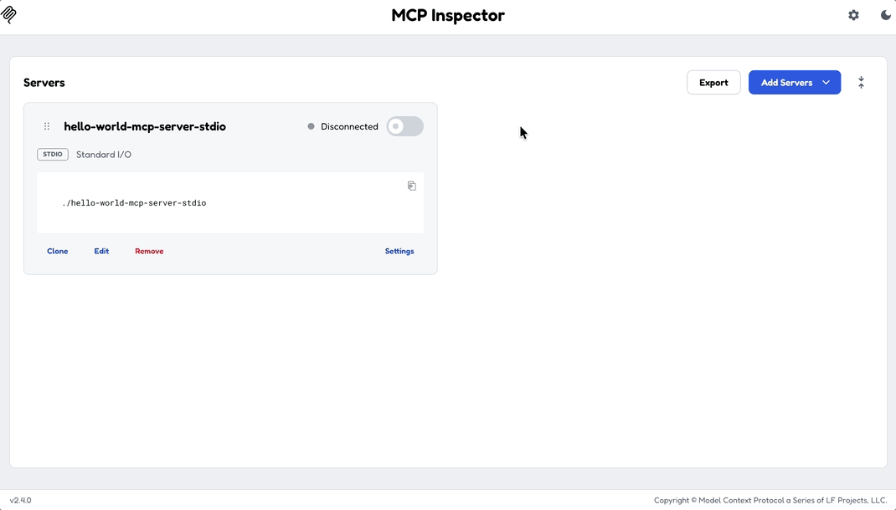

<p align="center">
  
</p>


<div align="center">

[](https://crates.io/crates/rust-mcp-sdk)
[](https://docs.rs/rust-mcp-sdk)
[](https://github.com/rust-mcp-stack/rust-mcp-sdk/actions/workflows/ci.yml)
[](https://github.com/rust-mcp-stack/rust-mcp-sdk/actions/workflows/conformance.yml)

A high-performance, asynchronous Rust toolkit for building MCP servers and clients.

[Documentation](https://rust-mcp-stack.github.io/rust-mcp-sdk/) · [Tutorials](https://rust-mcp-stack.github.io/rust-mcp-sdk/docs/tutorials/build-your-first-mcp-server) · [Examples](https://github.com/rust-mcp-stack/rust-mcp-sdk/tree/main/crates/rust-mcp-sdk/examples) · [Upgrade Guide](UPGRADING.md) · [Changelog](CHANGELOG.md) <br/>
[Contributing](CONTRIBUTING.md) · [Report a bug](https://github.com/rust-mcp-stack/rust-mcp-sdk/issues/new?template=bug_report.md) · [Request a Feature](https://github.com/rust-mcp-stack/rust-mcp-sdk/issues/new?template=feature_request.md)

</div>

This SDK fully implements the [MCP 2026-07-28](https://docs.rs/rust-mcp-schema/latest/rust_mcp_schema/) stateless protocol and passes **100% of official MCP conformance tests** (110/110 server, 440/440 client).

`rust-mcp-sdk` provides the necessary components for developing both servers and clients in the MCP ecosystem. It leverages the [rust-mcp-schema](https://crates.io/crates/rust-mcp-schema) crate for type-safe schema objects and includes powerful procedural macros.

Focus on your application logic, rust-mcp-sdk handles the protocol, transports, and the rest.

> **Version matrix:**
> | SDK version | Protocol | Branch |
> |---|---|---|
> | 2.0 (beta) | MCP 2026-07-28 (stateless) | `main` |
> | 1.x (LTS) | MCP 2025-11-25 | `release-1.x` |
>
> **Upgrading?** See the [upgrade guide](UPGRADING.md).

**Key Features**
- MCP 2026-07-28 (stateless protocol) - no initialize, no sessions
- **100% MCP Conformance** - server 110/110, client 440/440 on 2026-07-28
- Transports: Stdio, Streamable HTTP, and backward-compatible SSE support
- Framework Agnostic: Axum, Actix, and BYO Server integrations
- MRTR (Mid-Request Turn-Around) for server→client input requests
- Response cache (SEP-2549) with principal-scoped privacy + auto-pagination
- Per-request `_meta` with `RequestContext`
- Multi-client concurrency
- DNS Rebinding Protection
- Message Observer (Telemetry & Monitoring)
- HTTP Health Checks (for load balancers & container orchestration)
- OAuth Authentication for MCP Servers
  - [Remote Oauth Provider](crates/rust-mcp-sdk/src/auth/auth_provider/remote_auth_provider.rs)
    - **Keycloak** Provider (via [rust-mcp-extra](crates/rust-mcp-extra/README.md#keycloak))
    - **WorkOS** Authkit Provider (via [rust-mcp-extra](crates/rust-mcp-extra/README.md#workos-authkit))
    - **Scalekit** Authkit Provider (via [rust-mcp-extra](crates/rust-mcp-extra/README.md#scalekit))
- OAuth Authentication for MCP Clients (metadata discovery, CIMD, PKCE, token refresh, pluggable storage)
- Issuer-bound credentials (SEP-2352), strict `iss` validation (SEP-2468)

## Table of Contents
- [Quick Start](#quick-start)
- [Minimal MCP Server (Stdio)](#minimal-mcp-server-stdio)
- [Minimal MCP Server (Streamable HTTP)](#minimal-mcp-server-streamable-http)
- [Minimal MCP Client (Stdio)](#minimal-mcp-client-stdio)
- [Usage Examples](#usage-examples)
- [Macros](#macros)
  - [mcp_tool](#mcp_tool)
  - [tool_box](#-tool_box)
  - [mcp_elicit](#-mcp_elicit)
  - [mcp_resource](#-mcp_resource)
  - [mcp_resource_template](#-mcp_resource_template)
  - [mcp_prompt](#-mcp_prompt)
  - [mcp_icon](#-mcp_icon)
- [Authentication](#authentication)
- [HTTP Server Backends (Axum & Actix)](#http-server-backends-axum--actix)
- [Cargo features](#cargo-features)
- [Handler Traits](#handler-traits)
- [Message Observer (Telemetry & Monitoring)](#message-observer-telemetry--monitoring)
- [Health Check Endpoint](#health-check-endpoint)
- [Projects using Rust MCP SDK](#projects-using-rust-mcp-sdk)
- [Contributing](#contributing)
- [Development](#development)
- [License](#license)


## Quick Start

<!-- x-release-please-start-version -->

Add to your Cargo.toml:
```toml
[dependencies]
rust-mcp-sdk = "2.0.0-beta"  # Check crates.io for the latest version
```
<!-- x-release-please-end -->


## Minimal MCP Server (Stdio)
```rs
use async_trait::async_trait;
use rust_mcp_sdk::{
    error::SdkResult, macros,
    mcp_server::{server_runtime, ServerHandler},
    schema::*,
};

// Define an MCP tool
#[macros::mcp_tool(name = "say_hello", description = "returns \"Hello from Rust MCP SDK!\" message")]
#[derive(Debug, ::serde::Deserialize, ::serde::Serialize, macros::JsonSchema)]
pub struct SayHelloTool {}

// Define a custom handler
#[derive(Default)]
struct HelloHandler;

#[async_trait]
impl ServerHandler for HelloHandler {
    async fn handle_list_tools_request(
        &self,
        _request: Option<PaginatedRequestParams>,
        _context: &RequestContext,
        _runtime: std::sync::Arc<dyn McpServer>,
    ) -> std::result::Result<ListToolsResult, RpcError> {
        Ok(ListToolsResult {
            tools: vec![SayHelloTool::tool()],
            meta: None,
            next_cursor: None,
            cache_scope: Default::default(),
            result_type: "complete".to_string(),
            ttl_ms: 0,
        })
    }

    async fn handle_call_tool_request(
        &self,
        params: CallToolRequestParams,
        _context: &RequestContext,
        _runtime: std::sync::Arc<dyn McpServer>,
    ) -> std::result::Result<ServerResult, CallToolError> {
        if params.name == "say_hello" {
            Ok(ServerResult::CallToolResult(CallToolResult {
                content: vec![ContentBlock::TextContent(TextContent::new(
                    "Hello from Rust MCP SDK!".to_string(),
                    None,
                    None,
                ))],
                is_error: None,
                meta: None,
                result_type: "complete".to_string(),
            }))
        } else {
            Err(CallToolError::unknown_tool(params.name))
        }
    }
}

#[tokio::main]
async fn main() -> SdkResult<()> {
    let server_details = ServerDetails {
        server_info: Implementation {
            name: "hello-rust-mcp".into(),
            version: "0.1.0".into(),
            title: Some("Hello World MCP Server".into()),
            description: Some("A minimal Rust MCP server".into()),
            icons: vec![mcp_icon!(
                src = "https://raw.githubusercontent.com/rust-mcp-stack/rust-mcp-sdk/main/assets/rust-mcp-icon.png",
                mime_type = "image/png",
                sizes = ["128x128"],
                theme = "light"
            )],
            website_url: Some("https://github.com/rust-mcp-stack/rust-mcp-sdk".into()),
        },
        capabilities: ServerCapabilities {
            tools: Some(ServerCapabilitiesTools { list_changed: None }),
            ..Default::default()
        },
        instructions: None,
        meta: None,
    };

    let transport = StdioTransport::new(TransportOptions::default())?;
    let handler = HelloHandler::default().to_mcp_server_handler();
    let server = server_runtime::create_server(server_details, transport, handler);
    server.start().await
}
```

## HTTP Server Backends (Axum & Actix)

Creating a Streamable HTTP MCP server in `rust-mcp-sdk` allows multiple clients to connect simultaneously with no additional setup. The setup is nearly identical to the stdio example , the only difference is which HTTP backend crate you install and which function you call to create the server.

Post only - the 2026-07-28 protocol is stateless. GET and DELETE endpoints return 405 Method Not Allowed.

### Axum Backend (`rust-mcp-axum`)

Add [`rust-mcp-axum`](https://crates.io/crates/rust-mcp-axum) to your dependencies and use `create_axum_server()` with `AxumServerOptions`.

```rust
use async_trait::async_trait;
use rust_mcp_axum::{create_axum_server, AxumServerOptions};
use rust_mcp_sdk::{
    error::SdkResult, macros,
    mcp_server::ServerHandler, schema::*,
};

// ... (define SayHelloTool and HelloHandler as shown above)

#[tokio::main]
async fn main() -> SdkResult<()> {
    let server_details = ServerDetails { /* ... */ };

    let handler = HelloHandler::default().to_mcp_server_handler();
    let server = create_axum_server(
        server_details,
        handler,
        AxumServerOptions {
            host: "127.0.0.1".to_string(),
            ..Default::default()
        },
    );
    server.start().await?;
    Ok(())
}
```

### Actix-web Backend (`rust-mcp-actix`)

Add [`rust-mcp-actix`](https://crates.io/crates/rust-mcp-actix) to your dependencies and use `create_actix_server()` with `ActixServerOptions`.

```rust
use rust_mcp_actix::{create_actix_server, ActixServerOptions};
use rust_mcp_sdk::{
    error::SdkResult,
    mcp_server::ServerHandler, schema::*,
};

// ... (define SayHelloTool and HelloHandler as shown above)

#[tokio::main]
async fn main() -> SdkResult<()> {
    let server_details = ServerDetails { /* ... */ };

    let handler = HelloHandler::default().to_mcp_server_handler();
    let server = create_actix_server(
        server_details,
        handler,
        ActixServerOptions {
            host: "127.0.0.1".to_string(),
            ..Default::default()
        },
    );
    server.start().await?;
    Ok(())
}
```

### BYO-server: Embed MCP in your Existing App

Both backends support a **BYO-server** (Bring Your Own Server) mode, letting you mount MCP endpoints onto a router or app you already control - no need to hand over the server lifecycle.

| Backend | Function | Docs |
|---|---|---|
| Axum | `mcp_routes(state, &mount_opts, http_handler)` | [`rust-mcp-axum` README](crates/rust-mcp-axum/README.md) |
| Actix-web | `mcp_scope(state, http_handler, &mount_opts)` | [`rust-mcp-actix` README](crates/rust-mcp-actix/README.md) |

### Custom HTTP Framework Integrations

The SDK is completely framework-agnostic. If you are using a different HTTP framework (like Rocket, Salvo, or Warp), you can build a custom integration by adapting your framework's native Request/Response types to the SDK's core HTTP handling logic.

See the [Custom HTTP Framework Integration Guide](doc/custom-http-framework-integration.md) for architectural details.

### AxumServerOptions

Axum server is highly customizable through `AxumServerOptions`:

```rs
let server = create_axum_server(
    server_details,
    handler.to_mcp_server_handler(),
    AxumServerOptions {
        host: "127.0.0.1".to_string(),
        port: 8080,
        auth: Some(Arc::new(auth_provider)),           // enable authentication
        health_endpoint: Some("/health".into()),         // health check
        sse_support: true,                               // backward-compat SSE
        ..Default::default()
    },
);
server.start().await?;
```

### Security Considerations

- DNS rebinding protection is enabled by default. If `allowed_hosts` is not set, it auto-derives from `host:port`.
- When running locally, bind only to localhost (127.0.0.1 / localhost) rather than all network interfaces (0.0.0.0)
- Use TLS/HTTPS for production deployments

Following is implementation of an MCP client that starts the [@modelcontextprotocol/server-everything](https://www.npmjs.com/package/@modelcontextprotocol/server-everything) server, discovers the server's capabilities, lists available tools, and calls a tool.

```rust
use async_trait::async_trait;
use rust_mcp_sdk::{
    error::SdkResult,
    mcp_client::{client_runtime, ClientHandler},
    schema::*,
};

pub struct MyClientHandler;
#[async_trait]
impl ClientHandler for MyClientHandler {
    // Override handler methods as needed.
    // See: crates/rust-mcp-sdk/src/mcp_handlers/mcp_client_handler.rs
}

#[tokio::main]
async fn main() -> SdkResult<()> {
    let client_details = ClientDetails {
        client_info: Implementation {
            name: "simple-rust-mcp-client".into(),
            version: "0.1.0".into(),
            description: None,
            icons: vec![],
            title: None,
            website_url: None,
        },
        capabilities: ClientCapabilities::default(),
    };

    let transport = StdioTransport::create_with_server_launch(
        "npx",
        vec!["-y".to_string(), "@modelcontextprotocol/server-everything@latest".to_string()],
        None,
        TransportOptions::default(),
    )?;

    let handler = MyClientHandler {};
    let client = client_runtime::create_client(client_details, transport, handler);
    client.clone().start().await?;

    // Discover the server
    let discover = client.request_discover().await?;
    println!("Server: {}@{}", discover.server_info.name, discover.server_info.version);

    // List tools
    let tools = client.request_tool_list(None).await?.tools;
    tools.iter().enumerate().for_each(|(i, tool)| {
        println!("  {}. {} : {}", i + 1, tool.name, tool.description.unwrap_or_default());
    });

    // Call a tool (supports MRTR auto-retry)
    let result = client.call_tool(CallToolRequestParams {
        name: "say_hello".to_string(),
        arguments: None,
        meta: RequestMetaObject::default(),
    }).await?;

    client.shut_down().await?;
    Ok(())
}
```

## Usage Examples

For more examples (stdio, Streamable HTTP, clients, auth, etc.), see the [examples/](crates/rust-mcp-sdk/examples/) directory.

👉 For step-by-step tutorials (server, client, HTTP deployment, OAuth, and more), see the [documentation site](https://rust-mcp-stack.github.io/rust-mcp-sdk/docs/tutorials/build-your-first-mcp-server).

See the [hello-world-mcp-server-stdio](crates/rust-mcp-sdk/examples/hello-world-mcp-server-stdio.rs) example running in the [MCP Inspector](https://modelcontextprotocol.io/docs/tools/inspector):




## Macros
Enable with the `macros` feature.

### `mcp_tool`
Generate a [Tool](https://docs.rs/rust-mcp-schema/latest/rust_mcp_schema/struct.Tool.html) from a struct, with metadata (icons, hints, etc.).

```rs
#[mcp_tool(
    name = "write_file",
    title = "Write File Tool",
    description = "Create or overwrite a file with new content.",
    destructive_hint = false, idempotent_hint = false, open_world_hint = false, read_only_hint = false,
    meta = r#"{ "key": "value" }"#,
    icons = [(src = "https://website.com/write.png", mime_type = "image/png", sizes = ["128x128"], theme = "light")]
)]
#[derive(rust_mcp_macros::JsonSchema)]
pub struct WriteFileTool {
    /// The target file's path for writing content.
    pub path: String,
    /// The string content to be written to the file
    pub content: String,
}
```

### `tool_box!()` 
Automatically generates an enum based on the provided list of tools.

```rs
tool_box!(GreetingTools, [SayHelloTool, SayGoodbyeTool]);
let tools: Vec<Tool> = GreetingTools::tools();
```

### `mcp_elicit()`
Generates type-safe elicitation (Form or URL mode) for user input.

```rs
#[mcp_elicit(message = "Please enter your info", mode = form)]
#[derive(JsonSchema)]
pub struct UserInfo {
    #[json_schema(title = "Name", min_length = 5, max_length = 100)]
    pub name: String,
    #[json_schema(title = "Email", format = "email")]
    pub email: Option<String>,
    #[json_schema(title = "Age", minimum = 15, maximum = 125)]
    pub age: i32,
    #[json_schema(title = "Tags")]
    pub tags: Vec<String>,
}
```

### ◾ [mcp_resource()](https://crates.io/crates/rust-mcp-macros)
A procedural macro attribute that generates utility methods to create fully populated [Resource](https://docs.rs/rust-mcp-schema/latest/rust_mcp_schema/struct.Resource.html) instances from compile-time metadata , usually used for exposing static assets like files, images, or documents. Also generates a `RESOURCE_URI` associated constant, usable in `match` patterns, and a `resource_mime_type()` accessor.

📝 For complete documentation, example usage, and a list of all available attributes, please refer to https://crates.io/crates/rust-mcp-macros.

 ### ◾ [mcp_resource_template()](https://crates.io/crates/rust-mcp-macros)
A procedural macro attribute that generates utility methods to create fully populated [ResourceTemplate](https://docs.rs/rust-mcp-schema/latest/rust_mcp_schema/struct.ResourceTemplate.html) instances from compile-time metadata for exposing parameterized server resources. Also generates a `RESOURCE_URI_TEMPLATE` associated constant, usable in `match` patterns, and a `resource_template_mime_type()` accessor.

📝 For complete documentation, example usage, and a list of all available attributes, please refer to https://crates.io/crates/rust-mcp-macros.

### ◾ [mcp_prompt()](https://crates.io/crates/rust-mcp-macros)
A procedural macro attribute that generates utility methods to create fully populated [Prompt](https://docs.rs/rust-mcp-schema/latest/rust_mcp_schema/struct.Prompt.html) instances from compile-time metadata, and , when the optional `messages` attribute is provided , to parse request arguments (`from_arguments`) and render them into a `GetPromptResult` (`render`). Struct fields become typed prompt arguments (`String` = required, `Option<String>` = optional, `String` + `default` = fallback), the prompts/get handler itself is left to the user.

📝 For complete documentation, example usage, and a list of all available attributes, please refer to https://crates.io/crates/rust-mcp-macros.

### ◾ `mcp_icon!()`
A convenient icon builder for implementations and tools, offering full attribute support including theme, size, mime, and more.

example usage:
```rs
let icon: crate::schema::Icon = mcp_icon!(
    src = "http://website.com/icon.png",
    mime_type = "image/png",
    sizes = ["64x64"],
    theme = "dark"
);
```

## Authentication
MCP servers can verify tokens issued by other systems, integrate with external identity providers, or manage the entire authentication process.

### RemoteAuthProvider
[RemoteAuthProvider](crates/rust-mcp-sdk/src/mcp_http/auth/auth_provider/remote_auth_provider.rs) enables authentication with identity providers that support Dynamic Client Registration (DCR), letting MCP clients auto-register and obtain credentials.

### OAuthProxy
OAuthProxy enables authentication with OAuth providers that don't support DCR.

## Cargo Features

### Available Features

- `server`: Activates MCP server capabilities
- `client`: Activates MCP client capabilities
- `macros`: Procedural macros for Tool, Elicit, Resource structures
- `sse`: Server-Sent Events (SSE) transport
- `streamable-http`: Streamable HTTP transport
- `stdio`: Standard input/output (stdio) transport
- `auth`: OAuth authentication support for MCP servers
- `tls-no-provider`: TLS without a crypto provider

### Default Features

All features are enabled by default:

<!-- x-release-please-start-version -->

```toml
[dependencies]
rust-mcp-sdk = "2.0.0-beta"
```
<!-- x-release-please-end -->

### Using Only the Server Features

<!-- x-release-please-start-version -->

```toml
[dependencies]
rust-mcp-sdk = { version = "2.0.0-beta", default-features = false, features = ["server", "macros", "stdio"] }
```
<!-- x-release-please-end -->

### Using Only the Client Features

<!-- x-release-please-start-version -->

```toml
[dependencies]
rust-mcp-sdk = { version = "2.0.0-beta", default-features = false, features = ["client", "stdio"] }
```
<!-- x-release-please-end -->

## Handler Traits

### Choosing Between `ServerHandler` and `ServerHandlerCore`

- **ServerHandler**: Recommended. Default implementations for all MCP messages. Override only what you need.
- **ServerHandlerCore**: Full control over request/notification/error dispatch.

**Note:** Use `server_runtime::create_server()` or `server_runtime_core::create_server()` depending on which handler you implement.

### Choosing Between `ClientHandler` and `ClientHandlerCore`

Same principles apply on the client side: use `client_runtime::create_client()` with `ClientHandler`, or `client_runtime_core::create_client()` with `ClientHandlerCore`.

## Message Observer (Telemetry & Monitoring)

Implement `McpObserver` to intercept all incoming and outgoing MCP messages for telemetry, logging, debugging, or monitoring.

```rs
let server = server_runtime::create_server_with_options(ServerOptions {
    server_details,
    transport,
    handler: handler.to_mcp_server_handler(),
    extensions: None,
    message_observer: Some(SimpleServerObserver::new()),
});
```

## Health Check Endpoint

An optional HTTP health check endpoint for load balancers and container orchestration:

```rs
let server = create_axum_server(
    server_details,
    handler.to_mcp_server_handler(),
    AxumServerOptions {
        host: "127.0.0.1".into(),
        health_endpoint: Some("/health".into()),
        ..Default::default()
    },
);
```

## Projects using Rust MCP SDK

|  | Name | Description | Link |
|------|------|-------------|------|
| <a href="https://rust-mcp-stack.github.io/rust-mcp-filesystem"></a> | [Rust MCP Filesystem](https://rust-mcp-stack.github.io/rust-mcp-filesystem) | Fast, async MCP server enabling high-performance, modern filesystem operations with advanced features. | [GitHub](https://github.com/rust-mcp-stack/rust-mcp-filesystem) |
| <a href="https://rust-mcp-stack.github.io/mcp-discovery"></a> | [MCP Discovery](https://rust-mcp-stack.github.io/mcp-discovery) | A lightweight command-line tool for discovering and documenting MCP Server capabilities. | [GitHub](https://github.com/rust-mcp-stack/mcp-discovery) |
| <a href="https://github.com/EricLBuehler/mistral.rs"></a> | [mistral.rs](https://github.com/EricLBuehler/mistral.rs) | Blazingly fast LLM inference. | [GitHub](https://github.com/EricLBuehler/mistral.rs) |
| <a href="https://github.com/moonrepo/moon"></a> | [moon](https://github.com/moonrepo/moon) | moon is a repository management, organization, orchestration, and notification tool for the web ecosystem, written in Rust. | [GitHub](https://github.com/moonrepo/moon) |
| <a href="https://github.com/Dicklesworthstone/destructive_command_guard"></a> | [destructive_command_guard](https://github.com/Dicklesworthstone/destructive_command_guard) | The Destructive Command Guard (dcg) is for blocking dangerous git and shell commands from being executed by agents. - Dicklesworthstone/destructive_command_guard | [GitHub](https://github.com/Dicklesworthstone/destructive_command_guard) |
| <a href="https://github.com/KingOfBugbounty/enumrust"></a> | [enumrust](https://github.com/KingOfBugbounty/enumrust) | Subdomain Enumerator and Simple Crawler. Contribute to KingOfBugbounty/enumrust development by creating an account on GitHub. | [GitHub](https://github.com/KingOfBugbounty/enumrust) |
| <a href="https://github.com/bearcove/tracey"></a> | [tracey](https://github.com/bearcove/tracey) | CLI, Web, LSP, and MCP toolkit to measure spec coverage in Rust codebases - bearcove/tracey | [GitHub](https://github.com/bearcove/tracey) |
| <a href="https://github.com/azw413/Glass"></a> | [Glass](https://github.com/azw413/Glass) | Glass - a fast and free IDA Pro alternative. Contribute to azw413/Glass development by creating an account on GitHub. | [GitHub](https://github.com/azw413/Glass) |
| <a href="https://github.com/skanehira/ghost"></a> | [ghost](https://github.com/skanehira/ghost) | Simple background process manager for Unix systems - skanehira/ghost | [GitHub](https://github.com/skanehira/ghost) |
| <a href="https://github.com/paiml/aprender"></a> | [aprender](https://github.com/paiml/aprender) | Next Generation Machine Learning, Statistics and Deep Learning in PURE Rust - paiml/aprender | [GitHub](https://github.com/paiml/aprender) |
| <a href="https://github.com/mpsm/mcp-cpp"></a> | [mcp-cpp](https://github.com/mpsm/mcp-cpp) | MCP server tailored to work with large C/C++ codebases - mpsm/mcp-cpp | [GitHub](https://github.com/mpsm/mcp-cpp) |
| <a href="https://github.com/ProjectViVy/agent-diva"></a> | [agent-diva](https://github.com/ProjectViVy/agent-diva) | Next Generation AI Agent(AKA:nanobot-rs-pro). Contribute to ProjectViVy/agent-diva development by creating an account on GitHub. | [GitHub](https://github.com/ProjectViVy/agent-diva) |
| <a href="https://github.com/Vaiz/rust-mcp-server"></a> | [rust-mcp-server](https://github.com/Vaiz/rust-mcp-server) | `rust-mcp-server` allows the model to perform actions on your behalf, such as building, testing, and analyzing your Rust code. | [GitHub](https://github.com/Vaiz/rust-mcp-server) |
| <a href="https://github.com/cortesi/ruskel"></a> | [ruskel](https://github.com/cortesi/ruskel) | Ruskel generates skeletonized outlines of Rust crates. - cortesi/ruskel | [GitHub](https://github.com/cortesi/ruskel) |
| <a href="https://github.com/snailwei/ai-agent"></a> | [ai-agent](https://github.com/snailwei/ai-agent) | Idiomatic agent sdk inspired by the claude code source leak. - snailwei/ai-agent | [GitHub](https://github.com/snailwei/ai-agent) |
| <a href="https://github.com/LepistaBioinformatics/mycelium"></a> | [mycelium](https://github.com/LepistaBioinformatics/mycelium) | Mycelium API Gateway, the ultimate solution for secure, flexible, and multi-tenant API management - LepistaBioinformatics/mycelium | [GitHub](https://github.com/LepistaBioinformatics/mycelium) |
| <a href="https://github.com/FalkorDB/text-to-cypher"></a> | [text-to-cypher](https://github.com/FalkorDB/text-to-cypher) | A high-performance Rust-based API service that translates natural language text to Cypher queries for graph databases. | [GitHub](https://github.com/FalkorDB/text-to-cypher) |
| <a href="https://github.com/zen8labs/lunex"></a> | [lunex](https://github.com/zen8labs/lunex) | All-in-One Workspace AI. Contribute to zen8labs/lunex development by creating an account on GitHub. | [GitHub](https://github.com/zen8labs/lunex) |
| <a href="https://github.com/angreal/angreal"></a> | [angreal](https://github.com/angreal/angreal) | Angreal provides a way to template the structure of projects and a way of executing methods for interacting with that project in a consistent manner. | [GitHub](https://github.com/angreal/angreal) |


## Contributing

We welcome everyone who wishes to contribute! Please refer to the [contributing](CONTRIBUTING.md) guidelines for more details.

Check out our [development guide](development.md) for instructions on setting up, building, testing, formatting, and trying out example projects.

All contributions, including issues and pull requests, must follow Rust's Code of Conduct.

Unless explicitly stated otherwise, any contribution you submit for inclusion in rust-mcp-sdk is provided under the terms of the MIT License, without any additional conditions or restrictions.

## Development

Check out our [development guide](development.md) for instructions on setting up, building, testing, formatting, and trying out example projects.

## License

This project is licensed under the MIT License. see the [LICENSE](LICENSE) file for details.
