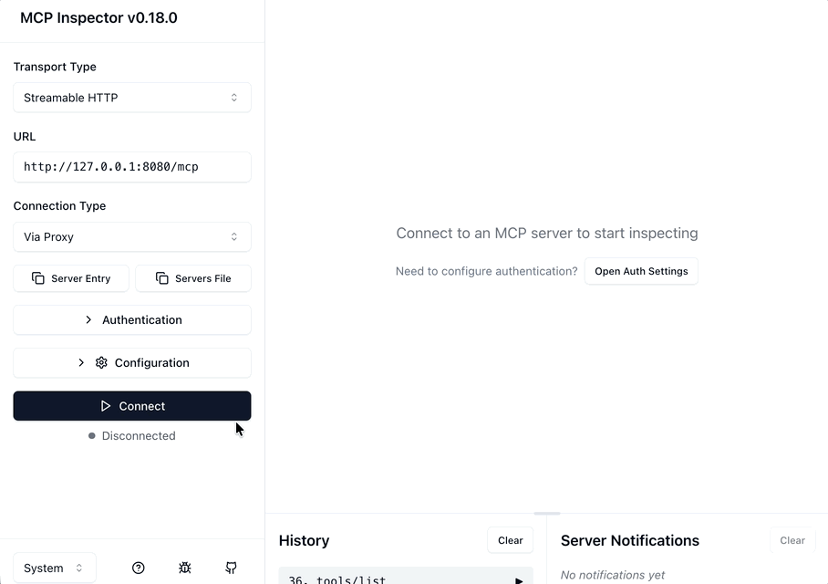

<p align="center">
  
</p>

# Rust MCP SDK

[](https://crates.io/crates/rust-mcp-sdk)
[](https://docs.rs/rust-mcp-sdk)
[
](https://github.com/rust-mcp-stack/rust-mcp-sdk/actions/workflows/ci.yml)
[
](examples/hello-world-mcp-server-stdio)

A high-performance, asynchronous toolkit for building MCP servers and clients.
Focus on your app's logic while **rust-mcp-sdk** takes care of the rest!

**rust-mcp-sdk** provides the necessary components for developing both servers and clients in the MCP ecosystem.
Leveraging the [rust-mcp-schema](https://github.com/rust-mcp-stack/rust-mcp-schema) crate simplifies the process of building robust and reliable MCP servers and clients, ensuring consistency and minimizing errors in data handling and message processing.


**rust-mcp-sdk**  supports all three official versions of the MCP protocol.
By default, it uses the **2025-06-18** version, but earlier versions can be enabled via Cargo features.


This project supports following transports:
- **Stdio** (Standard Input/Output)
- **Streamable HTTP**
- **SSE** (Server-Sent Events)


🚀 The **rust-mcp-sdk** includes a lightweight [Axum](https://github.com/tokio-rs/axum) based server that handles all core functionality seamlessly. Switching between `stdio` and `Streamable HTTP` is straightforward, requiring minimal code changes. The server is designed to efficiently handle multiple concurrent client connections and offers built-in support for SSL.


**MCP Streamable HTTP Support**
- ✅ Streamable HTTP Support for MCP Servers
- ✅ DNS Rebinding Protection
- ✅ Batch Messages
- ✅ Streaming & non-streaming JSON response
- ✅ Streamable HTTP Support for MCP Clients
- ✅ Resumability
- ⬜ Oauth Authentication

**⚠️** Project is currently under development and should be used at your own risk.

## Table of Contents
- [Usage Examples](#usage-examples)
  - [MCP Server (stdio)](#mcp-server-stdio)
  - [MCP Server (Streamable HTTP)](#mcp-server-streamable-http)
  - [MCP Client (stdio)](#mcp-client-stdio)
  - [MCP Client (Streamable HTTP)](#mcp-client_streamable-http))
  - [MCP Client (sse)](#mcp-client-sse)
- [Macros](#macros)
- [Getting Started](#getting-started)
- [HyperServerOptions](#hyperserveroptions)
  - [Security Considerations](#security-considerations)
- [Cargo features](#cargo-features)
  -  [Available Features](#available-features)
    - [MCP protocol versions with corresponding features](#mcp-protocol-versions-with-corresponding-features)
  -  [Default Features](#default-features)
  -  [Using Only the server Features](#using-only-the-server-features)
  -  [Using Only the client Features](#using-only-the-client-features)
- [Choosing Between Standard and Core Handlers traits](#choosing-between-standard-and-core-handlers-traits)
  - [Choosing Between **ServerHandler** and **ServerHandlerCore**](#choosing-between-serverhandler-and-serverhandlercore)
  - [Choosing Between **ClientHandler** and **ClientHandlerCore**](#choosing-between-clienthandler-and-clienthandlercore)
- [Projects using Rust MCP SDK](#projects-using-rust-mcp-sdk)
- [Contributing](#contributing)
- [Development](#development)
- [License](#license)

## Usage Examples

### MCP Server (stdio)

Create a MCP server with a `tool` that will print a `Hello World!` message:

```rust
#[tokio::main]
async fn main() -> SdkResult<()> {

    // STEP 1: Define server details and capabilities
    let server_details = InitializeResult {
        // server name and version
        server_info: Implementation {
            name: "Hello World MCP Server".to_string(),
            version: "0.1.0".to_string(),
            title: Some("Hello World MCP Server".to_string()),
        },
        capabilities: ServerCapabilities {
            // indicates that server support mcp tools
            tools: Some(ServerCapabilitiesTools { list_changed: None }),
            ..Default::default() // Using default values for other fields
        },
        meta: None,
        instructions: Some("server instructions...".to_string()),
        protocol_version: LATEST_PROTOCOL_VERSION.to_string(),
    };

    // STEP 2: create a std transport with default options
    let transport = StdioTransport::new(TransportOptions::default())?;

    // STEP 3: instantiate our custom handler for handling MCP messages
    let handler = MyServerHandler {};

    // STEP 4: create a MCP server
    let server: ServerRuntime = server_runtime::create_server(server_details, transport, handler);

    // STEP 5: Start the server
    server.start().await

}
```

See hello-world-mcp-server-stdio example running in [MCP Inspector](https://modelcontextprotocol.io/docs/tools/inspector) :


### MCP Server (Streamable HTTP)

Creating an MCP server in `rust-mcp-sdk` with the `sse` transport allows multiple clients to connect simultaneously with no additional setup.
Simply create a Hyper Server using `hyper_server::create_server()` and pass in the same handler and HyperServerOptions.


💡 By default, both **Streamable HTTP** and **SSE** transports are enabled for backward compatibility. To disable the SSE transport , set the `sse_support` to false in the `HyperServerOptions`.


```rust

// STEP 1: Define server details and capabilities
let server_details = InitializeResult {
    // server name and version
    server_info: Implementation {
        name: "Hello World MCP Server".to_string(),
        version: "0.1.0".to_string(),
        title: Some("Hello World MCP Server".to_string()),
    },
    capabilities: ServerCapabilities {
        // indicates that server support mcp tools
        tools: Some(ServerCapabilitiesTools { list_changed: None }),
        ..Default::default() // Using default values for other fields
    },
    meta: None,
    instructions: Some("server instructions...".to_string()),
    protocol_version: LATEST_PROTOCOL_VERSION.to_string(),
};

// STEP 2: instantiate our custom handler for handling MCP messages
let handler = MyServerHandler {};

// STEP 3: instantiate HyperServer, providing `server_details` , `handler` and HyperServerOptions
let server = hyper_server::create_server(
    server_details,
    handler,
    HyperServerOptions {
        host: "127.0.0.1".to_string(),
        sse_support: false,
        event_store: Some(Arc::new(InMemoryEventStore::default())), // enable resumability
        ..Default::default()
    },
);

// STEP 4: Start the server
server.start().await?;

Ok(())
```


The implementation of `MyServerHandler` is the same regardless of the transport used and could be as simple as the following:

```rust

// STEP 1: Define a rust_mcp_schema::Tool ( we need one with no parameters for this example)
#[mcp_tool(name = "say_hello_world", description = "Prints \"Hello World!\" message")]
#[derive(Debug, Deserialize, Serialize, JsonSchema)]
pub struct SayHelloTool {}

// STEP 2: Implement ServerHandler trait for a custom handler
// For this example , we only need handle_list_tools_request() and handle_call_tool_request() methods.
pub struct MyServerHandler;

#[async_trait]
impl ServerHandler for MyServerHandler {
    // Handle ListToolsRequest, return list of available tools as ListToolsResult
    async fn handle_list_tools_request(&self, request: ListToolsRequest, runtime: Arc<dyn McpServer>) -> Result<ListToolsResult, RpcError> {

        Ok(ListToolsResult {
            tools: vec![SayHelloTool::tool()],
            meta: None,
            next_cursor: None,
        })

    }

    /// Handles requests to call a specific tool.
    async fn handle_call_tool_request( &self, request: CallToolRequest, runtime: Arc<dyn McpServer> ) -> Result<CallToolResult, CallToolError> {

        if request.tool_name() == SayHelloTool::tool_name() {
            Ok( CallToolResult::text_content( vec![TextContent::from("Hello World!".to_string())]  ))
        } else {
            Err(CallToolError::unknown_tool(request.tool_name().to_string()))
        }

    }
}
```

---

👉 For a more detailed example of a [Hello World MCP](https://github.com/rust-mcp-stack/rust-mcp-sdk/tree/main/examples/hello-world-mcp-server-stdio) Server that supports multiple tools and provides more type-safe handling of `CallToolRequest`, check out: **[examples/hello-world-mcp-server](https://github.com/rust-mcp-stack/rust-mcp-sdk/tree/main/examples/hello-world-mcp-server)**

See hello-world-server-streamable-http example running in [MCP Inspector](https://modelcontextprotocol.io/docs/tools/inspector) :



---

### MCP Client (stdio)

Create an MCP client that starts the [@modelcontextprotocol/server-everything](https://www.npmjs.com/package/@modelcontextprotocol/server-everything) server, displays the server's name, version, and list of tools, then uses the add tool provided by the server to sum 120 and 28, printing the result.

```rust

// STEP 1: Custom Handler to handle incoming MCP Messages
pub struct MyClientHandler;

#[async_trait]
impl ClientHandler for MyClientHandler {
    // To check out a list of all the methods in the trait that you can override, take a look at https://github.com/rust-mcp-stack/rust-mcp-sdk/blob/main/crates/rust-mcp-sdk/src/mcp_handlers/mcp_client_handler.rs
}

#[tokio::main]
async fn main() -> SdkResult<()> {

    // Step2 : Define client details and capabilities
    let client_details: InitializeRequestParams = InitializeRequestParams {
        capabilities: ClientCapabilities::default(),
        client_info: Implementation {
            name: "simple-rust-mcp-client".into(),
            version: "0.1.0".into(),
        },
        protocol_version: LATEST_PROTOCOL_VERSION.into(),
    };

    // Step3 : Create a transport, with options to launch @modelcontextprotocol/server-everything MCP Server
    let transport = StdioTransport::create_with_server_launch(
        "npx",
        vec![ "-y".to_string(), "@modelcontextprotocol/server-everything".to_string()],
        None, TransportOptions::default()
    )?;

    // STEP 4: instantiate our custom handler for handling MCP messages
    let handler = MyClientHandler {};

    // STEP 5: create a MCP client
    let client = client_runtime::create_client(client_details, transport, handler);

    // STEP 6: start the MCP client
    client.clone().start().await?;


    // STEP 7: use client methods to communicate with the MCP Server as you wish

    // Retrieve and display the list of tools available on the server
    let server_version = client.server_version().unwrap();
    let tools = client.list_tools(None).await?.tools;

    println!("List of tools for {}@{}", server_version.name, server_version.version);

    tools.iter().enumerate().for_each(|(tool_index, tool)| {
        println!("  {}. {} : {}",
            tool_index + 1,
            tool.name,
            tool.description.clone().unwrap_or_default()
        );
    });

    println!("Call \"add\" tool with 100 and 28 ...");
    // Create a `Map<String, Value>` to represent the tool parameters
    let params = json!({"a": 100,"b": 28}).as_object().unwrap().clone();
    let request = CallToolRequestParams { name: "add".to_string(),arguments: Some(params)};

    // invoke the tool
    let result = client.call_tool(request).await?;

    println!("{}",result.content.first().unwrap().as_text_content()?.text);

    client.shut_down().await?;

    Ok(())
}

```

Here is the output :


> your results may vary slightly depending on the version of the MCP Server in use when you run it.

### MCP Client (Streamable HTTP)
```rs

// STEP 1: Custom Handler to handle incoming MCP Messages
pub struct MyClientHandler;

#[async_trait]
impl ClientHandler for MyClientHandler {
    // To check out a list of all the methods in the trait that you can override, take a look at https://github.com/rust-mcp-stack/rust-mcp-sdk/blob/main/crates/rust-mcp-sdk/src/mcp_handlers/mcp_client_handler.rs
}

#[tokio::main]
async fn main() -> SdkResult<()> {

    // Step2 : Define client details and capabilities
    let client_details: InitializeRequestParams = InitializeRequestParams {
        capabilities: ClientCapabilities::default(),
        client_info: Implementation {
            name: "simple-rust-mcp-client-sse".to_string(),
            version: "0.1.0".to_string(),
            title: Some("Simple Rust MCP Client (SSE)".to_string()),
        },
        protocol_version: LATEST_PROTOCOL_VERSION.into(),
    };

    // Step 3: Create transport options to connect to an MCP server via Streamable HTTP.
    let transport_options = StreamableTransportOptions {
        mcp_url: MCP_SERVER_URL.to_string(),
        request_options: RequestOptions {
            ..RequestOptions::default()
        },
    };

    // STEP 4: instantiate the custom handler that is responsible for handling MCP messages
    let handler = MyClientHandler {};

    // STEP 5: create the client with transport options and the handler
    let client = client_runtime::with_transport_options(client_details, transport_options, handler);

    // STEP 6: start the MCP client
    client.clone().start().await?;

    // STEP 7: use client methods to communicate with the MCP Server as you wish

    // Retrieve and display the list of tools available on the server
    let server_version = client.server_version().unwrap();
    let tools = client.list_tools(None).await?.tools;
    println!("List of tools for {}@{}", server_version.name, server_version.version);

    tools.iter().enumerate().for_each(|(tool_index, tool)| {
        println!("  {}. {} : {}",
            tool_index + 1,
            tool.name,
            tool.description.clone().unwrap_or_default()
        );
    });

    println!("Call \"add\" tool with 100 and 28 ...");
    // Create a `Map<String, Value>` to represent the tool parameters
    let params = json!({"a": 100,"b": 28}).as_object().unwrap().clone();
    let request = CallToolRequestParams { name: "add".to_string(),arguments: Some(params)};

    // invoke the tool
    let result = client.call_tool(request).await?;

    println!("{}",result.content.first().unwrap().as_text_content()?.text);

    client.shut_down().await?;

    Ok(())
```
👉 see [examples/simple-mcp-client-streamable-http](https://github.com/rust-mcp-stack/rust-mcp-sdk/tree/main/examples/simple-mcp-client-streamable-http) for a complete working example.


### MCP Client (sse)
Creating an MCP client using the `rust-mcp-sdk` with the SSE transport is almost identical to the [stdio example](#mcp-client-stdio) , with one exception at `step 3`. Instead of creating a `StdioTransport`, you simply create a `ClientSseTransport`. The rest of the code remains the same:

```diff
- let transport = StdioTransport::create_with_server_launch(
-    "npx",
-    vec![ "-y".to_string(), "@modelcontextprotocol/server-everything".to_string()],
-    None, TransportOptions::default()
-)?;
+ let transport = ClientSseTransport::new(MCP_SERVER_URL, ClientSseTransportOptions::default())?;
```

👉 see [examples/simple-mcp-client-sse](https://github.com/rust-mcp-stack/rust-mcp-sdk/tree/main/examples/simple-mcp-client-sse) for a complete working example.


## Macros
[rust-mcp-sdk](https://github.com/rust-mcp-stack/rust-mcp-sdk) includes several helpful macros that simplify common tasks when building MCP servers and clients. For example, they can automatically generate tool specifications and tool schemas right from your structs, or assist with elicitation requests and responses making them completely type safe.

> To use these macros, ensure the `macros` feature is enabled in your Cargo.toml.

### mcp_tool
`mcp_tool` is a procedural macro attribute that helps generating rust_mcp_schema::Tool from a struct.

Usage example:
```rust
#[mcp_tool(
    name = "move_file",
    title="Move File",
    description = concat!("Move or rename files and directories. Can move files between directories ",
"and rename them in a single operation. If the destination exists, the ",
"operation will fail. Works across different directories and can be used ",
"for simple renaming within the same directory. ",
"Both source and destination must be within allowed directories."),
    destructive_hint = false,
    idempotent_hint = false,
    open_world_hint = false,
    read_only_hint = false
)]
#[derive(::serde::Deserialize, ::serde::Serialize, Clone, Debug, JsonSchema)]
pub struct MoveFileTool {
    /// The source path of the file to move.
    pub source: String,
    /// The destination path to move the file to.
    pub destination: String,
}

// Now we can call `tool()` method on it to get a Tool instance
let rust_mcp_sdk::schema::Tool = MoveFileTool::tool();

```

💻 For a real-world example, check out any of the tools available at: https://github.com/rust-mcp-stack/rust-mcp-filesystem/tree/main/src/tools


### tool_box
`tool_box` generates an enum from a provided list of tools, making it easier to organize and manage them, especially when your application includes a large number of tools.

It accepts an array of tools and generates an enum where each tool becomes a variant of the enum.

Generated enum has a `tools()` function that returns a `Vec<Tool>` , and a `TryFrom<CallToolRequestParams>` trait implementation that could be used to convert a ToolRequest into a Tool instance.

Usage example:
```rust
    // Accepts an array of tools and generates an enum named `FileSystemTools`,
    // where each tool becomes a variant of the enum.
    tool_box!(FileSystemTools, [ReadFileTool, MoveFileTool, SearchFilesTool]);

    // now in the app, we can use the FileSystemTools, like:
    let all_tools: Vec<Tool> = FileSystemTools::tools();
```

💻 To see a real-world example of that please see :
- `tool_box` macro usage:  [https://github.com/rust-mcp-stack/rust-mcp-filesystem/blob/main/src/tools.rs](https://github.com/rust-mcp-stack/rust-mcp-filesystem/blob/main/src/tools.rs)
- using `tools()` in list tools request :  [https://github.com/rust-mcp-stack/rust-mcp-filesystem/blob/main/src/handler.rs](https://github.com/rust-mcp-stack/rust-mcp-filesystem/blob/main/src/handler.rs#L67)
- using `try_from` in call tool_request: [https://github.com/rust-mcp-stack/rust-mcp-filesystem/blob/main/src/handler.rs](https://github.com/rust-mcp-stack/rust-mcp-filesystem/blob/main/src/handler.rs#L100)


### mcp_elicit
The `mcp_elicit` macro generates implementations for the annotated struct to facilitate data elicitation. It enables struct to generate `ElicitRequestedSchema` and also parsing a map of field names to `ElicitResultContentValue` values back into the struct, supporting both required and optional fields. The generated implementation includes:

- A `message()` method returning the elicitation message as a string.
- A `requested_schema()` method returning an `ElicitRequestedSchema` based on the struct’s JSON schema.
- A `from_content_map()` method to convert a map of `ElicitResultContentValue` values into a struct instance.

### Attributes

- `message` - An optional string (or `concat!(...)` expression) to prompt the user or system for input. Defaults to an empty string if not provided.

Usage example:
```rust
// A struct that could be used to send elicit request and get the input from the user
#[mcp_elicit(message = "Please enter your info")]
#[derive(JsonSchema)]
pub struct UserInfo {
    #[json_schema(
        title = "Name",
        description = "The user's full name",
        min_length = 5,
        max_length = 100
    )]
    pub name: String,
    /// Is user a student?
    #[json_schema(title = "Is student?", default = true)]
    pub is_student: Option<bool>,

    /// User's favorite color
    pub favorate_color: Colors,
}

// send a Elicit Request , ask for UserInfo data and convert the result back to a valid UserInfo instance
let result: ElicitResult = server
    .elicit_input(UserInfo::message(), UserInfo::requested_schema())
    .await?;

// Create a UserInfo instance using data provided by the user on the client side
let user_info = UserInfo::from_content_map(result.content)?;

```

💻 For mre info please see :
- https://github.com/rust-mcp-stack/rust-mcp-sdk/tree/main/crates/rust-mcp-macros

## Getting Started

If you are looking for a step-by-step tutorial on how to get started with `rust-mcp-sdk` , please see : [Getting Started MCP Server](https://github.com/rust-mcp-stack/rust-mcp-sdk/tree/main/doc/getting-started-mcp-server.md)

## HyperServerOptions

HyperServer is a lightweight Axum-based server that streamlines MCP servers by supporting **Streamable HTTP** and **SSE** transports. It supports simultaneous client connections, internal session management, and includes built-in security features like DNS rebinding protection and more.

HyperServer is highly customizable through HyperServerOptions provided during initialization.

A typical example of creating a HyperServer that exposes the MCP server via Streamable HTTP and SSE transports at:

```rs

let server = hyper_server::create_server(
    server_details,
    handler,
    HyperServerOptions {
        host: "127.0.0.1".to_string(),
        enable_ssl: true,
        ..Default::default()
    },
);

server.start().await?;

```

Here is a list of available options with descriptions for configuring the HyperServer:
```rs

pub struct HyperServerOptions {
    /// Hostname or IP address the server will bind to (default: "127.0.0.1")
    pub host: String,

    /// Hostname or IP address the server will bind to (default: "8080")
    pub port: u16,

    /// Optional thread-safe session id generator to generate unique session IDs.
    pub session_id_generator: Option<Arc<dyn IdGenerator<SessionId>>>,

    /// Optional custom path for the Streamable HTTP endpoint (default: `/mcp`)
    pub custom_streamable_http_endpoint: Option<String>,

    /// Shared transport configuration used by the server
    pub transport_options: Arc<TransportOptions>,

    /// Event store for resumability support
    /// If provided, resumability will be enabled, allowing clients to reconnect and resume messages
    pub event_store: Option<Arc<dyn EventStore>>,

    /// This setting only applies to streamable HTTP.
    /// If true, the server will return JSON responses instead of starting an SSE stream.
    /// This can be useful for simple request/response scenarios without streaming.
    /// Default is false (SSE streams are preferred).
    pub enable_json_response: Option<bool>,

    /// Interval between automatic ping messages sent to clients to detect disconnects
    pub ping_interval: Duration,

    /// Enables SSL/TLS if set to `true`
    pub enable_ssl: bool,

    /// Path to the SSL/TLS certificate file (e.g., "cert.pem").
    /// Required if `enable_ssl` is `true`.
    pub ssl_cert_path: Option<String>,

    /// Path to the SSL/TLS private key file (e.g., "key.pem").
    /// Required if `enable_ssl` is `true`.
    pub ssl_key_path: Option<String>,

    /// List of allowed host header values for DNS rebinding protection.
    /// If not specified, host validation is disabled.
    pub allowed_hosts: Option<Vec<String>>,

    /// List of allowed origin header values for DNS rebinding protection.
    /// If not specified, origin validation is disabled.
    pub allowed_origins: Option<Vec<String>>,

    /// Enable DNS rebinding protection (requires allowedHosts and/or allowedOrigins to be configured).
    /// Default is false for backwards compatibility.
    pub dns_rebinding_protection: bool,

    /// If set to true, the SSE transport will also be supported for backward compatibility (default: true)
    pub sse_support: bool,

    /// Optional custom path for the Server-Sent Events (SSE) endpoint (default: `/sse`)
    /// Applicable only if sse_support is true
    pub custom_sse_endpoint: Option<String>,

    /// Optional custom path for the MCP messages endpoint for sse (default: `/messages`)
    /// Applicable only if sse_support is true
    pub custom_messages_endpoint: Option<String>,
}

```

### Security Considerations

When using Streamable HTTP transport, following security best practices are recommended:

- Enable DNS rebinding protection and provide proper `allowed_hosts` and `allowed_origins` to prevent DNS rebinding attacks.
- When running locally, bind only to localhost (127.0.0.1 / localhost) rather than all network interfaces (0.0.0.0)
- Use TLS/HTTPS for production deployments


## Cargo Features

The `rust-mcp-sdk` crate provides several features that can be enabled or disabled. By default, all features are enabled to ensure maximum functionality, but you can customize which ones to include based on your project's requirements.

### Available Features

- `server`: Activates MCP server capabilities in `rust-mcp-sdk`, providing modules and APIs for building and managing MCP servers.
- `client`: Activates MCP client capabilities, offering modules and APIs for client development and communicating with MCP servers.
- `hyper-server`: This feature is necessary to enable `Streamable HTTP` or `Server-Sent Events (SSE)` transports for MCP servers. It must be used alongside the server feature to support the required server functionalities.
- `ssl`: This feature enables TLS/SSL support for the `Streamable HTTP` or `Server-Sent Events (SSE)` transport when used with the `hyper-server`.
- `macros`: Provides procedural macros for simplifying the creation and manipulation of MCP Tool structures.
- `sse`: Enables support for the `Server-Sent Events (SSE)` transport.
- `streamable-http`: Enables support for the `Streamable HTTP` transport.

- `stdio`: Enables support for the `standard input/output (stdio)` transport.
- `tls-no-provider`: Enables TLS without a crypto provider. This is useful if you are already using a different crypto provider than the aws-lc default.


#### MCP Protocol Versions with Corresponding Features

- `2025_06_18` : Activates MCP Protocol version 2025-06-18 (enabled by default)
- `2025_03_26` : Activates MCP Protocol version 2025-03-26
- `2024_11_05` : Activates MCP Protocol version 2024-11-05

> Note: MCP protocol versions are mutually exclusive—only one can be active at any given time.

### Default Features

When you add rust-mcp-sdk as a dependency without specifying any features, all features are included, with the latest MCP Protocol version enabled by default:

<!-- x-release-please-start-version -->

```toml
[dependencies]
rust-mcp-sdk = "0.2.0"
```

<!-- x-release-please-end -->

### Using Only the server Features

If you only need the MCP Server functionality, you can disable the default features and explicitly enable the server feature. Add the following to your Cargo.toml:

<!-- x-release-please-start-version -->

```toml
[dependencies]
rust-mcp-sdk = { version = "0.2.0", default-features = false, features = ["server","macros","stdio"] }
```
Optionally add `hyper-server` and `streamable-http` for **Streamable HTTP** transport, and `ssl` feature for tls/ssl support of the `hyper-server`

<!-- x-release-please-end -->

### Using Only the client Features

If you only need the MCP Client functionality, you can disable the default features and explicitly enable the client feature.
Add the following to your Cargo.toml:

<!-- x-release-please-start-version -->

```toml
[dependencies]
rust-mcp-sdk = { version = "0.2.0", default-features = false, features = ["client","2024_11_05","stdio"] }
```

<!-- x-release-please-end -->

## Choosing Between Standard and Core Handlers traits
Learn when to use the  `mcp_*_handler` traits versus the lower-level `mcp_*_handler_core` traits for both server and client implementations. This section helps you decide based on your project's need for simplicity versus fine-grained control.

### Choosing Between `ServerHandler` and `ServerHandlerCore`

[rust-mcp-sdk](https://github.com/rust-mcp-stack/rust-mcp-sdk) provides two type of handler traits that you can chose from:

- **ServerHandler**: This is the recommended trait for your MCP project, offering a default implementation for all types of MCP messages. It includes predefined implementations within the trait, such as handling initialization or responding to ping requests, so you only need to override and customize the handler functions relevant to your specific needs.
  Refer to [examples/hello-world-mcp-server-stdio/src/handler.rs](https://github.com/rust-mcp-stack/rust-mcp-sdk/tree/main/examples/hello-world-mcp-server-stdio/src/handler.rs) for an example.

- **ServerHandlerCore**: If you need more control over MCP messages, consider using `ServerHandlerCore`. It offers three primary methods to manage the three MCP message types: `request`, `notification`, and `error`. While still providing type-safe objects in these methods, it allows you to determine how to handle each message based on its type and parameters.
  Refer to [examples/hello-world-mcp-server-stdio-core/src/handler.rs](https://github.com/rust-mcp-stack/rust-mcp-sdk/tree/main/examples/hello-world-mcp-server-stdio-core/src/handler.rs) for an example.

---

**👉 Note:** Depending on whether you choose `ServerHandler` or `ServerHandlerCore`, you must use the `create_server()` function from the appropriate module:

- For `ServerHandler`:
  - Use `server_runtime::create_server()` for servers with stdio transport
  - Use `hyper_server::create_server()` for servers with sse transport

- For `ServerHandlerCore`:
  - Use `server_runtime_core::create_server()` for servers with stdio transport
  - Use `hyper_server_core::create_server()` for servers with sse transport

---


### Choosing Between `ClientHandler` and `ClientHandlerCore`

The same principles outlined above apply to the client-side handlers, `ClientHandler` and `ClientHandlerCore`.

- Use `client_runtime::create_client()` when working with `ClientHandler`

- Use `client_runtime_core::create_client()` when working with `ClientHandlerCore`

Both functions create an MCP client instance.


Check out the corresponding examples at: [examples/simple-mcp-client-stdio](https://github.com/rust-mcp-stack/rust-mcp-sdk/tree/main/examples/simple-mcp-client-stdio) and [examples/simple-mcp-client-stdio-core](https://github.com/rust-mcp-stack/rust-mcp-sdk/tree/main/examples/simple-mcp-client-stdio-core).


## Projects using Rust MCP SDK

Below is a list of projects that utilize the `rust-mcp-sdk`, showcasing their name, description, and links to their repositories or project pages.

|  | Name | Description | Link |
|------|------|-------------|------|
| <a href="https://rust-mcp-stack.github.io/rust-mcp-filesystem"></a> | [Rust MCP Filesystem](https://rust-mcp-stack.github.io/rust-mcp-filesystem) | Fast, async MCP server enabling high-performance, modern filesystem operations with advanced features. | [GitHub](https://github.com/rust-mcp-stack/rust-mcp-filesystem) |
| <a href="https://rust-mcp-stack.github.io/mcp-discovery"></a> | [MCP Discovery](https://rust-mcp-stack.github.io/mcp-discovery) | A lightweight command-line tool for discovering and documenting MCP Server capabilities. | [GitHub](https://github.com/rust-mcp-stack/mcp-discovery) |
| <a href="https://github.com/EricLBuehler/mistral.rs"></a> | [mistral.rs](https://github.com/EricLBuehler/mistral.rs) | Blazingly fast LLM inference. | [GitHub](https://github.com/EricLBuehler/mistral.rs) |
| <a href="https://github.com/moonrepo/moon"></a> | [moon](https://github.com/moonrepo/moon) | moon is a repository management, organization, orchestration, and notification tool for the web ecosystem, written in Rust. | [GitHub](https://github.com/moonrepo/moon) |
| <a href="https://github.com/LepistaBioinformatics/mycelium"></a> | [mycelium](https://github.com/LepistaBioinformatics/mycelium) | `mycelium` is a modern, open-source platform for secure, flexible, and scalable API management. | [GitHub](https://github.com/LepistaBioinformatics/mycelium) |
| <a href="https://github.com/angreal/angreal"></a> | [angreal](https://github.com/angreal/angreal) | Angreal provides a way to template the structure of projects and a way of executing methods for interacting with that project in a consistent manner. | [GitHub](https://github.com/angreal/angreal) |
| <a href="https://github.com/FalkorDB/text-to-cypher"></a> | [text-to-cypher](https://github.com/FalkorDB/text-to-cypher) | A high-performance Rust-based API service that translates natural language text to Cypher queries for graph databases. | [GitHub](https://github.com/FalkorDB/text-to-cypher) |
| <a href="https://github.com/Tuurlijk/notify-mcp"></a> | [notify-mcp](https://github.com/Tuurlijk/notify-mcp) | A Model Context Protocol (MCP) server that provides desktop notification functionality. | [GitHub](https://github.com/Tuurlijk/notify-mcp) |
| <a href="https://github.com/WismutHansen/lst"></a> | [lst](https://github.com/WismutHansen/lst) | `lst` is a personal lists, notes, and blog posts management application with a focus on plain-text storage, offline-first functionality, and multi-device synchronization. | [GitHub](https://github.com/WismutHansen/lst) |
| <a href="https://github.com/Vaiz/rust-mcp-server"></a> | [rust-mcp-server](https://github.com/Vaiz/rust-mcp-server) | `rust-mcp-server` allows the model to perform actions on your behalf, such as building, testing, and analyzing your Rust code. | [GitHub](https://github.com/Vaiz/rust-mcp-server) |


## Contributing

We welcome everyone who wishes to contribute! Please refer to the [contributing](CONTRIBUTING.md) guidelines for more details.

Check out our [development guide](development.md) for instructions on setting up, building, testing, formatting, and trying out example projects.

All contributions, including issues and pull requests, must follow
Rust's Code of Conduct.

Unless explicitly stated otherwise, any contribution you submit for inclusion in rust-mcp-sdk is provided under the terms of the MIT License, without any additional conditions or restrictions.

## Development

Check out our [development guide](development.md) for instructions on setting up, building, testing, formatting, and trying out example projects.

## License

This project is licensed under the MIT License. see the [LICENSE](LICENSE) file for details.
