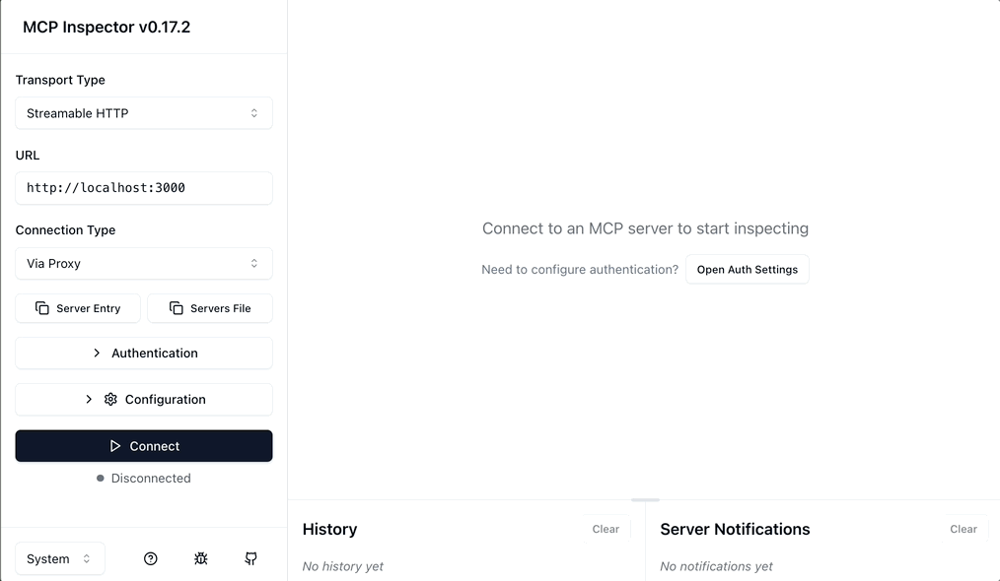

# MCP Server - Remote Oauth (Keycloack)


A minimal, MCP server example that demonstrates **OAuth 2.0 / OpenID Connect authentication** using the  `RemoteAuthProvider` from [rust-mcp-sdk](https://github.com/rust-mcp-stack/rust-mcp-sdk).

It features:
- Full OAuth 2.0 protection via bearer tokens
- Remote authentication metadata discovery
- Token verification using both JWKs and token introspection
- A single tool: `show_auth_info` - returns the authenticated user's claims and scopes in pretty-printed JSON

## Overview

**RemoteAuthProvider** can be used with any OpenID Connect provider that supports Dynamic Client Registration (DCR), but in this example, it is configured to point to a local [Keycloak](https://www.keycloak.org) instance.

👉 For more information on how to start and configure your local Keycloak server, please refer to the  **keycloak-setup** section of the following blog post: https://modelcontextprotocol.io/docs/tutorials/security/authorization#keycloak-setup


## Running the Example


### Step 1:
Clone the repo:
```bash
git clone git@github.com:rust-mcp-stack/rust-mcp-sdk.git
cd rust-mcp-sdk
```

### Step 2:
Make sure you have a Keycloak server running and configured as described in this [blog post](https://modelcontextprotocol.io/docs/tutorials/security/authorization#keycloak-setup)

> 💡 _You can update the configuration in `create_oauth_provider()` function to connect to any other OAuth provider with DCR support or in case your keycloak configuration is different._

### Step 3:
Set the `OAUTH_CLIENT_ID` and `OAUTH_CLIENT_SECRET` environment variables with the values from your keycloak server dashboard:

```
export OAUTH_CLIENT_ID=test-server OAUTH_CLIENT_SECRET=XYZ
```


### Step 3:
start the project

```bash
cargo run -p server-oauth-remote
```

You will see:

```sh
• Streamable HTTP Server is available at http://[::1]:3000/
```

You can test it with [MCP Inspector](https://modelcontextprotocol.io/docs/tools/inspector), or alternatively, use it with any MCP client you prefer.

```bash
npx -y @modelcontextprotocol/inspector@latest
```

Here you can see it in action :


